<!-- customize-you-profile:start -->
<!-- Generated by CustomizeYouProfile: this block is rewritten on every run. Move the whole block anywhere you like, or set `update-readme: false` to place the images yourself. -->
<picture>
  <source media="(prefers-color-scheme: dark)" srcset="profile-effects/intro-dark.svg">
  
</picture>

<picture>
  <source media="(prefers-color-scheme: dark)" srcset="profile-effects/skills-dark.svg">
  
</picture>

<picture>
  <source media="(prefers-color-scheme: dark)" srcset="profile-effects/dino-run-dark.svg">
  
</picture>

<picture>
  <source media="(prefers-color-scheme: dark)" srcset="profile-effects/space-shooter-dark.svg">
  
</picture>
<!-- customize-you-profile:end -->
